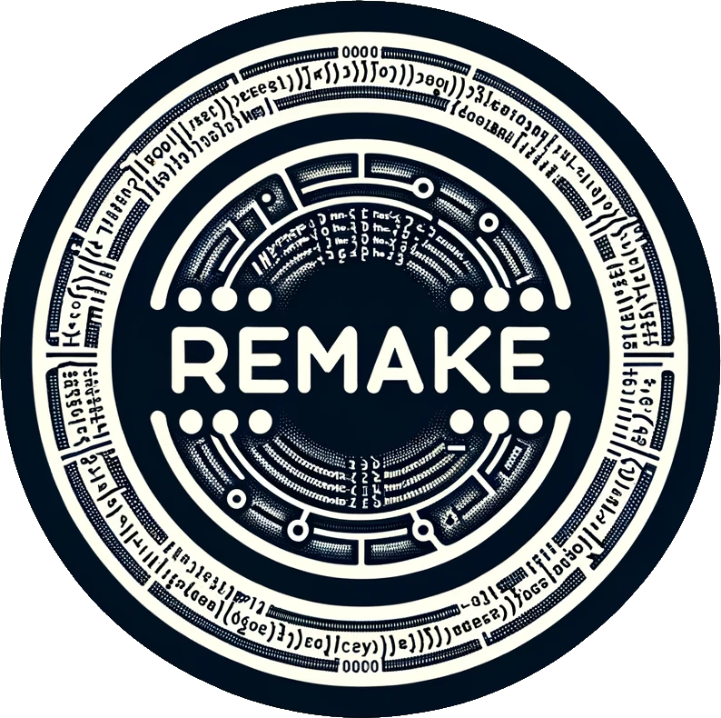

<p align="center">
  
</p>

# ReMake


ReMake is a Python-based make-like tool that simplifies the process of defining
and managing build rules for your projects. Unlike traditional makefiles,
ReMake leverages Python code directly within a ReMakeFile to express
dependencies and build actions. This approach provides a high degree of
flexibility and readability, making it a powerful tool for diverse project
structures.

## Table of Contents

- [Features](#features)
- [Installation](#installation)
- [Usage](#usage)
- [Examples](#examples)
- [Contributing](#contributing)
- [License](#license)

## Features

- **Dependency Tracking:** ReMake automatically tracks dependencies between
  files and rebuilds only the necessary targets when changes occur.
- **Flexible Build Rules:** Build rules are expressed using Python code,
  providing a high level of expressiveness and flexibility.
- **Dry Run Mode:** ReMake supports a dry run mode (`-n` or `--dry-run`), which
  displays actions without executing them.
- **Clean Mode:** ReMake can clean generated files using the clean mode (`-c`
  or `--clean`), removing specified targets.
- **Target Selection:** ReMake supports building a specific target given in
  command-line.
- **Rich Progress Output:** ReMake uses the `rich` library to display progress
  information in a clear and visually appealing way.
- **SubReMakeFile Support:** Use `SubReMakeFile` keyword to cut the build process into
  smaller ReMakeFiles.

## Installation

To install ReMake, clone the repository and run the following command:

```bash
git clone https://github.com/drakes00/remake.git
cd remake
pip install .
```
Or within a `poetry` environment, run the following command:
```bash
poetry add git+https://github.com/drakes00/remake.git
```

## Usage

To use ReMake, create a file named `ReMakeFile` in your project directory.
Define your build rules using Python code directly in this file. The main entry
point is the automatically parsed `ReMakeFile`, and the build process is
initiated by running:

```bash
remake [target]
```

`target` is an optionnal absolute path to a target specified in the ReMakeFile.
Key command-line options include:

- `-v` or `--verbose`: Enable verbose mode.
- `-n` or `--dry-run`: Perform a dry run, showing actions without executing them.
- `-c` or `--clean`: Clean specified targets.

For additional options and details, use:

```bash
remake --help
```

More information can be found in [documentation](./doc/).

## Examples

Here's an updated example of a `ReMakeFile`:

```python
# Define a builder with a custom action
fooBuilder = Builder(action="Magically creating $@ from $<")

# Define a rule for a specific target, creating `output.txt` from `input.txt`
# using builder `fooBuilder`.
Rule(targets="output.txt", deps="input.txt", builder=fooBuilder)

# Define a pattern rule to create `.bar` files from `.foo` files using builder
# `fooBuilder`.
PatternRule(target="*.bar", deps="*.foo", builder=fooBuilder)

# Declare targets to be built.
AddTarget("output.txt")
AddTarget("output.bar")

# Use SubReMakeFile to include a separate ReMakeFile
SubReMakeFile("subfolder")
```

In this example, a builder named `fooBuilder` is defined with an action. Then,
a rule is defined, creating `output.txt` from `input.txt` using `fooBuilder`. A
pattern rule is then created to build any `.bar` file from corresponding `.foo`
files using `fooBuilder`. Two targets are specified (`output.txt` and
`output.bar`), leading ReMake to look for rule allowing to build these targets
and their dependencies if needed. `SubReMakeFile` is used to include a separate
ReMakeFile located in the "subfolder" directory. This allows to cut the build
process into smaller, modular ReMakeFiles for better organization and
maintainability.

More examples can be found in [examples](./examples/).

## Contributing

Contributions to ReMake are welcome! Feel free to open issues, submit pull
requests, or provide feedback. For more details and contributions ideas, check
the [contributing guidelines](CONTRIBUTING.md).

## License

ReMake is licensed under the MIT License - see the [LICENSE](LICENSE) file for
details.
